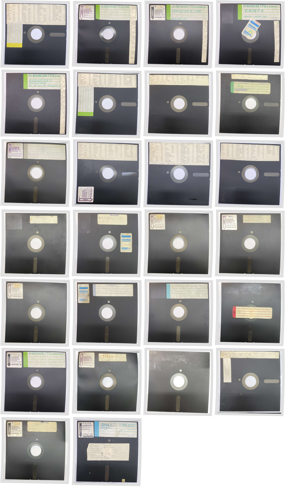

L.E.D. (Laboratorio de Electrónica Digital)
===

Instituto de enseñanza técnica de la calle Rivera Indarte 387.

Sus dueños Próspero Herrera y Carmen Ordoñez, tenían algunas cajas de diskettes 8" con software para equipos de Micro Sistemas.

