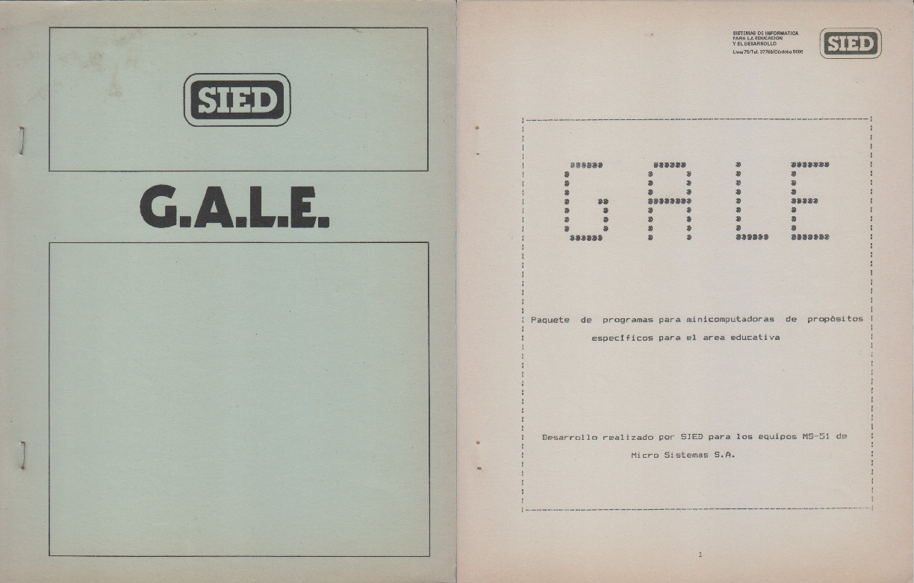
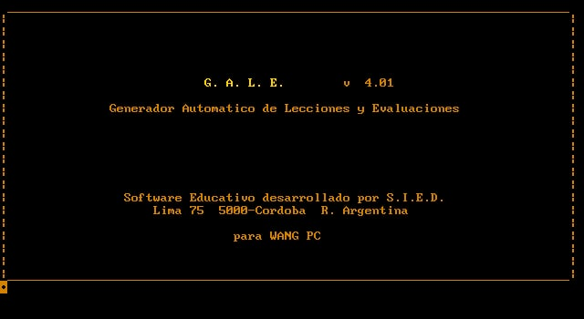

SIED
===

Sistemas de Informática para la Educación el Desarrollo fué una empresa de desarrollo de software en el primer piso de Lima 67 de Córdoba Capital.
Debajo estaba AES (Academia de Enseñanza Superior) y luego IES (Instituto de Enseñanza Superior) de Juan Carlos Rabbat.
SIED nace alrededor de 1982 a partir de la alianza entre Miguel Lewin (CEPICO) y Juan Carlos Rabbat (AES).

El equipo de trabajo estaba formado por
* Miguel Lewin, venía de CEPICO.
* Tomás Behrend, venía de Microsistemas.
* Daniel "el negro" Molina.

SIED desarrolló varios sistemas, entre ellos para Peusso Iluminación, Agro Centro SC (General Cabrera), Sistema de Apuestas del Jockey Club Córdoba, Ramos Hermanos, Arcor, Provencred entre otros.

Uno de los productos más interesantes fue GALE, el Generador Automático de Lecciones y Evaluaciones.
Este software fue desarrollado en BASIC originalmente para [Radio Shack TRS-80 Model III](https://en.wikipedia.org/wiki/List_of_TRS-80_and_Tandy-branded_computers#Model_III), pero luego fue portado a [MS51](../../Máquinas/MS51), a Wang PC y a PC.

Capturas de pantalla emuladas provistas por Gustavo del Dago:

Tomás Behrend contaba en febrero de 2022:

> El GALE estaba pensado para que cualquiera, no informático, pudiera hacer una clase y las evaluaciones de manera autónoma. Es decir, apuntábamos a generar un paquete de software educativo. Obviamente estábamos un poco adelantados ahí por los años 1983 u 84 , el hardware disponible era muy pobre aun (fundamentalmente a nivel gráficos en pantalla, y a la falta de discos fijos).
>
> La lecciones eran texto en pantalla, con alguna interactividad.
>
> Las evaluaciones eran preguntas a contestar por si o no; multiple choice; respuestas escritas generadas al azar dentro de un pool de preguntas previamente guardadas en el diskette. O sea cada alumno debía completar una evaluación distinta según lo que le tocaba.
>
> Se generaba un feed back (considerado fundamental en el proceso de aprendizaje) y el profe recibía un informe del desempeño de sus examinados.

Daniel Molina recuerda:

> En GALE un profe cargara 80 preguntas y las categorizaba, tiempo de duración.
> Había de 4 tipos: multiple opción, columnas relacionadas, llenado de blancos y verdadero/falso.
>
> Luego se tomaba un exámen, 20 preguntas 5 de esta categoría, y 4 de esta otra y el tiempo fijo por pregunta o no.
>
> Este sistema se usó mucho en AES. Se usó mucho para ingreso a Universidad.
> Sacaba preguntas al azar, cargaba DNI y hacía el exámen.
>
> Luego hacían un gráfico con los resultados. Yo armé un archivo indexado.
> Después lo migraron a la PC, pero no funcionó.
>
> También había un Curso de Autoestudio en BASIC, donde se mostraban las instrucciones y sintáxis y tenía un parser chiquito y te cantaba los mocos (errores).

Se rescataron algunas piezas de documentación y de software:

* [Manual de GALE](GALE_manual.pdf), preservado por [José Perlo](../../Personas/José%20Perlo).
* [Archivos fuetes de GALE PC](gale_src.zip), preservado por [Tomás Behrend](../../Personas/Tomás%20Behrend).
