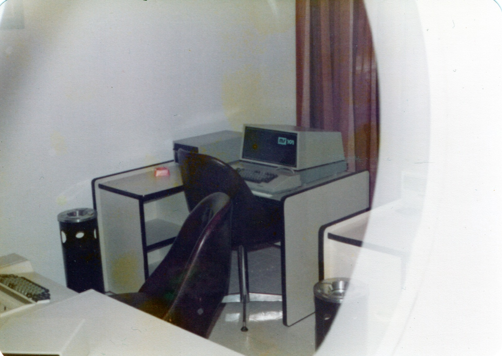
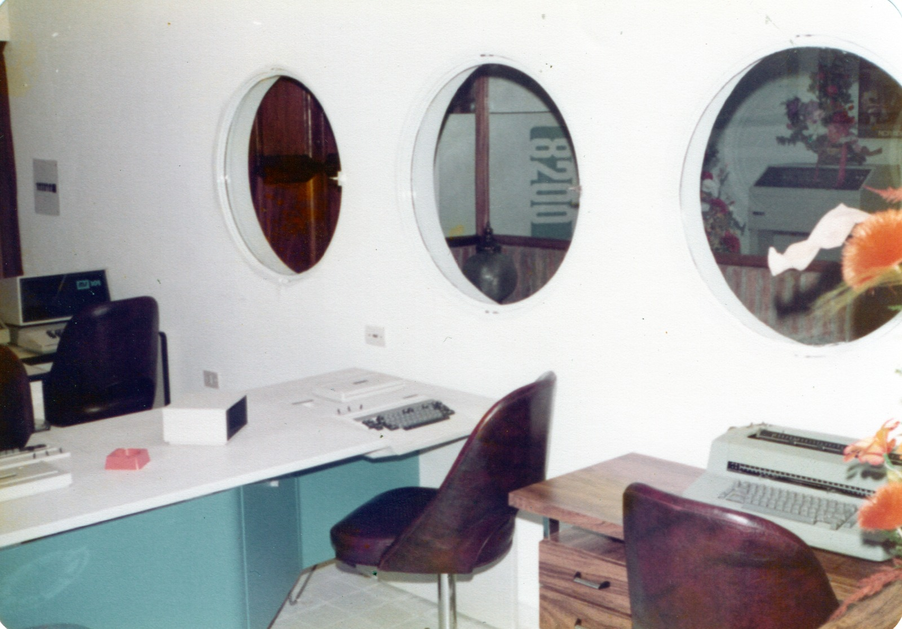
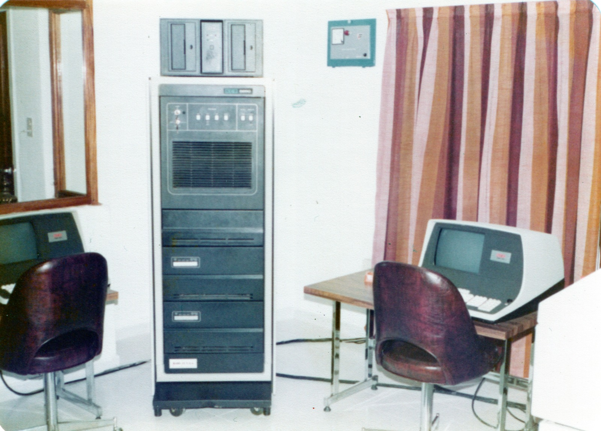

XCR
===

Centro de Cómputos de la Ciudad de Córdoba Capital.
X por varios y CR por Carlos Ropelato, el socio principal.

Ropelato le vende 100% de la empresa a Juan Carlos Lorenzati, que la opera en las décadas del 70 al 90.

Equipos:
* MS101, copia de la IBM 3741
* IBM 3742, Dual data station
* NCR 8250

