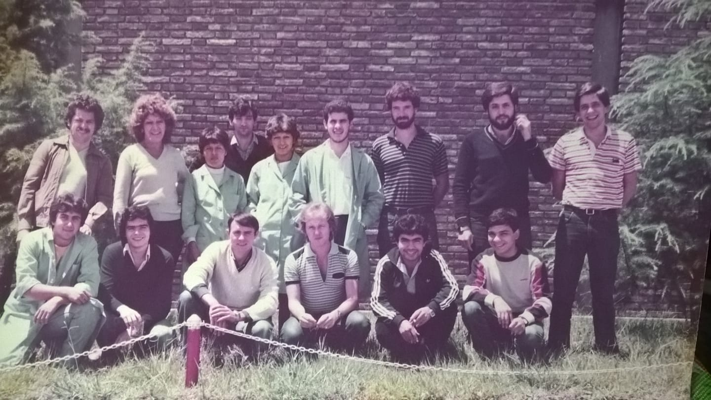
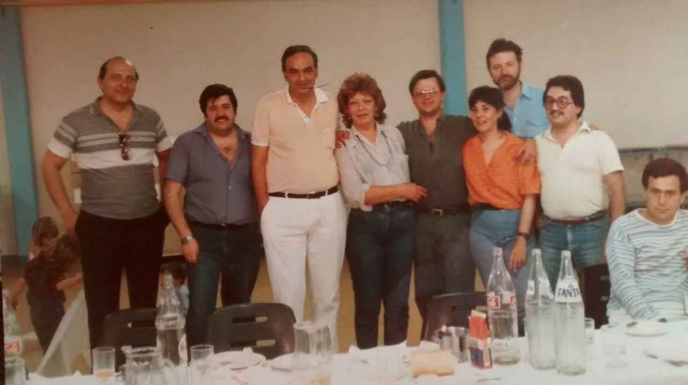

Av. Japón 210
===

En 1985 y con la inyección de capitales que hace Gustavo de Filipi, MicroSistemas se muda a un predio mucho más grande en la Avenida Japón 210.
Este fue su última ubicación hasta su cierre en 1995.

[Mapa](https://goo.gl/maps/wjYLBA7oShpKZLzi8)

Los comienzos en Av. Japón, circa otoño de 1985
===

Arriba, de izquierda a derecha
---

 1. Eduardo Cáceres, ensamble
 2. Carlos Margara, fuentes
 3. Jorge Reyero, ensamble
 4. Santiago Vidaurre, jefe de planta
 5. Patricia Machado, mangueras y placas
 6. [Mary Andrada](../../Personas/Mary%20Andrada/), jefa de mangueras y placas
 7. Ana Gómez, mangueras
 8. [Gabriel de Luca](../../Personas/Gabriel%20de%20Luca/), mangueras y placas
 9. Héctor Borgogno, técnico de reparaciones
10. Norberto Garrone, técnico de reparaciones
11. Pablo Reviglio, técnico de reparaciones
12. Víctor Sánchez, ensamble

Abajo, de izquierda a derecha
---
 1. "Cacho" Romero, técnico de reparaciones
 2. Denis Elías Hernández (Salvadoreño), mangueras y placas
 3. Alejandro Quinteros, mangueras y placas
 4. Domingo Carreño, ensamble

Hubo una segunda foto, donde no está el dueño de la cámara de fotos, Denis Elías Hernández.

Fiesta de Fin de Año 1985
===

1. Juan Salonia
2. Carlos Pelegrini
3. Cr. Eduardo González
4. Mary Andrada
5. Edgardo Rodríguez
6. Alicia, secretaria planta
7. Hugo Bonansea
8. Coco Reartes
9. ?

