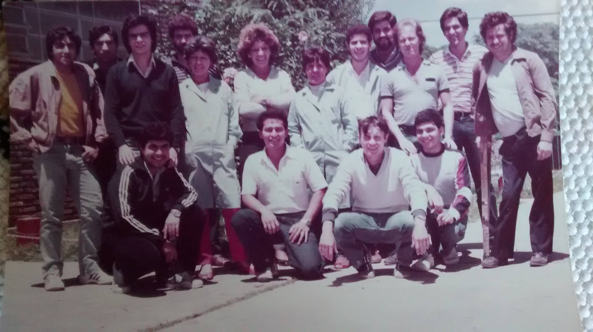

Av. Japón 210
===

En 1985 y con la inyección de capitales que hace Gustavo de Filipi, MicroSistemas se muda a un predio mucho más grande en la Avenida Japón 210.
Este fue su última ubicación hasta su cierre en 1992.

[Mapa](https://goo.gl/maps/wjYLBA7oShpKZLzi8)

Esta foto se sacó el primer día que los trabajadores y trabajadoras estuvieron en el Predio de Av. Japón.

Arriba, de izquierda a derecha
---

 1. Eduardo Cáceres, armado
 2. Carlos Margara, fuentes
 3. Jorge Reyero, calidad
 4. Santiago Vidaurre, jefe de planta
 5. Patricia Machado, mangueras y placas
 6. [Mary Andrada](../../Personas/Mary%20Andrada/), jefa de mangueras y placas
 7. Ana Gómez, mangueras
 8. [Gabriel de Luca](../../Personas/Gabriel%20de%20Luca/), calidad
 9. Héctor Borgogno, reparaciones
10. Norberto Garrone, supervisor armado
11. Pablo Reviglio, reparaciones
12. Víctor Sánchez, armado

Abajo, de izquierda a derecha
---
 1. "Cacho" Romero, técnico reparaciones
 2. Denis Elias Hernández (Salvadoreño), mangueras y placas
 3. Alejandro Quinteros, ?
 4. Domingo Carreño, repararaciones

