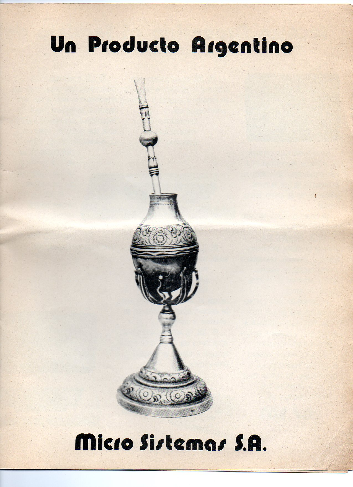
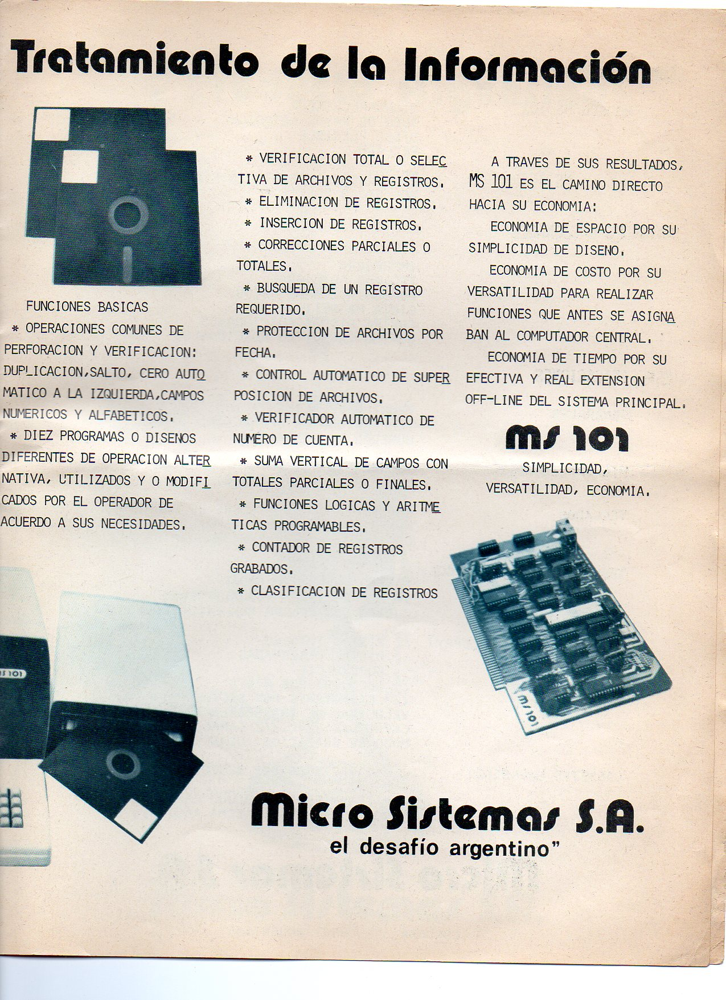
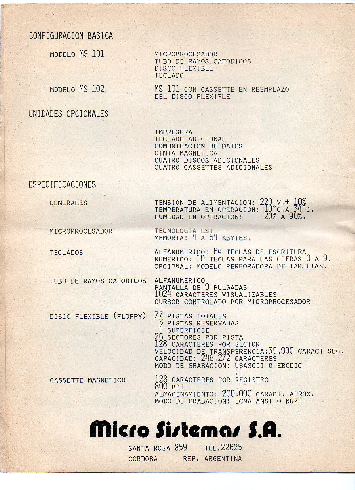
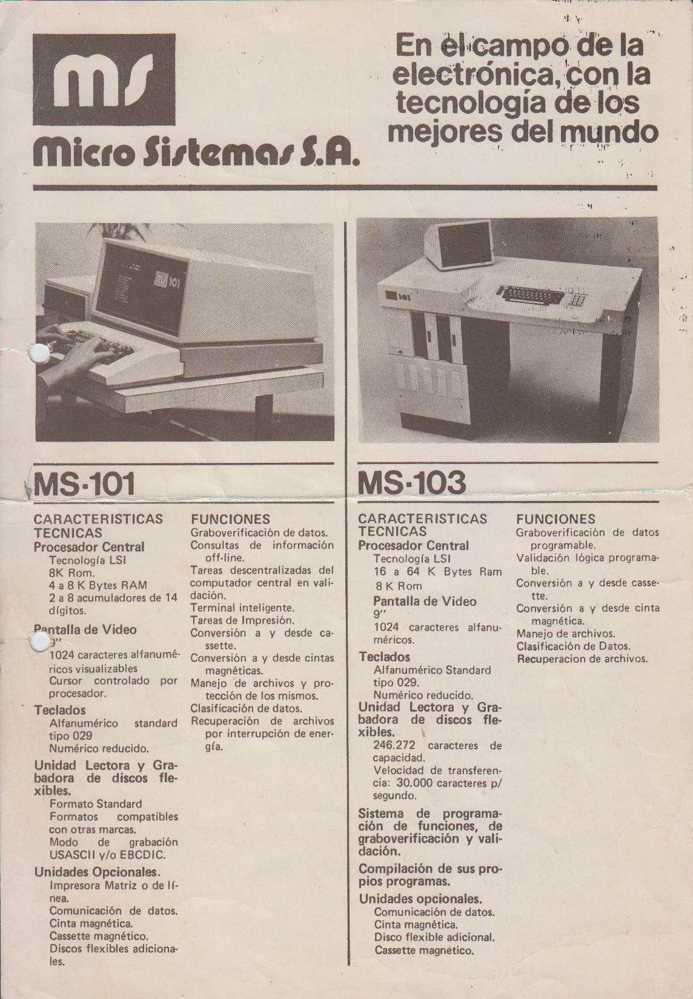
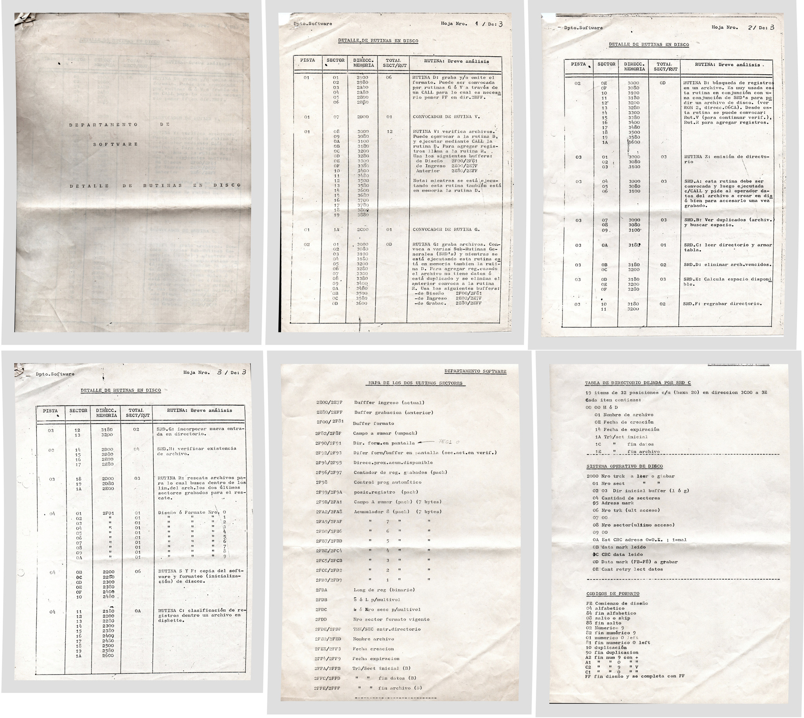

[Folleto](ms101_folleto_1977.pdf) que se usó para presentarla en Expoficina 77, colección de Tomás Behrend.
---


   


La MS101 estaba en estado de prototipo como se puede observar en la pantalla de la máquina.

El aspecto final de la máquina difiere a la mostrada en el folleto.
Nunca hubo una MS102 a casette, este nombre se utilizó para la estación de carga dual MS102.
Notar también como la placa que se muestra está toda con zócalos y en realidad no se corresponde con ninguna de las placas de la MS101: CPU, video, floppy, teclado.

La ficha que figura en pantalla se corresponde a un domicilio temporal que tuvo Julio Eduardo Bazán, en el mismo complejo que Héctor Müller cerca de 1977.

```

MICRO-SISTEMAS    M.S. 101        FECHA: 10/05/77    18:24:35

              P R O T O T I P O

NOMBRE   JULIO EDUARDO BAZAN

DOMICILIO   ITALIA 356 P ALTA -DEPTO 6

LOCALIDAD   VILLA CABRERA

PROVINCIA   CORDOBA
```

[Folleto](folleto_MS101_MS103_MS104.pdf) comercial de ¿1979?
---

 

[Formato de Disco](disco_MS101.pdf)
---

Aunque aun no hemos encontrado ningún diskette 8" de MS101, se sabe su formato.
<br>
<b>¡Si tenés uno, ponete en contacto con nosotros!</b>

