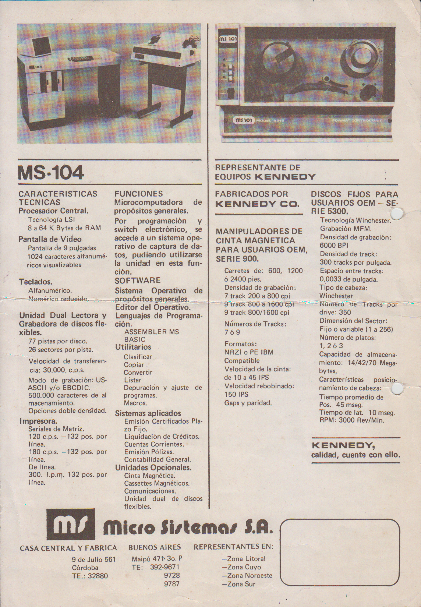
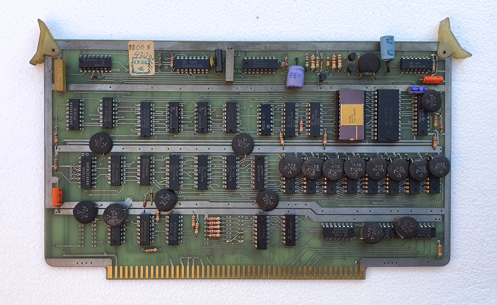
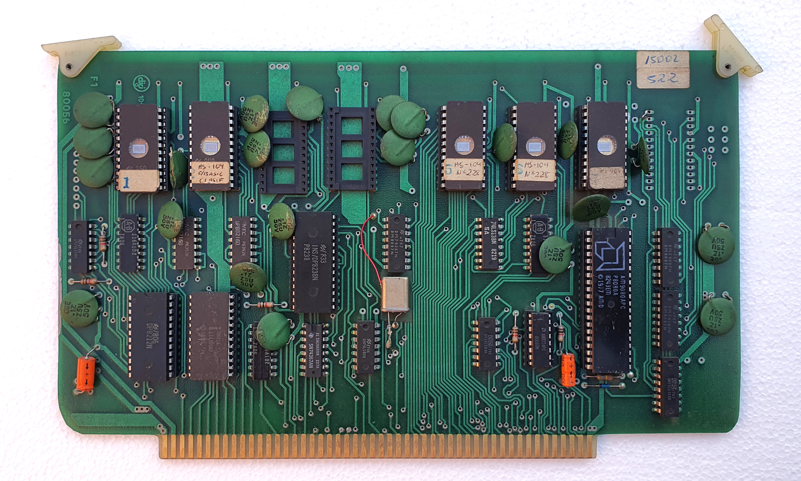
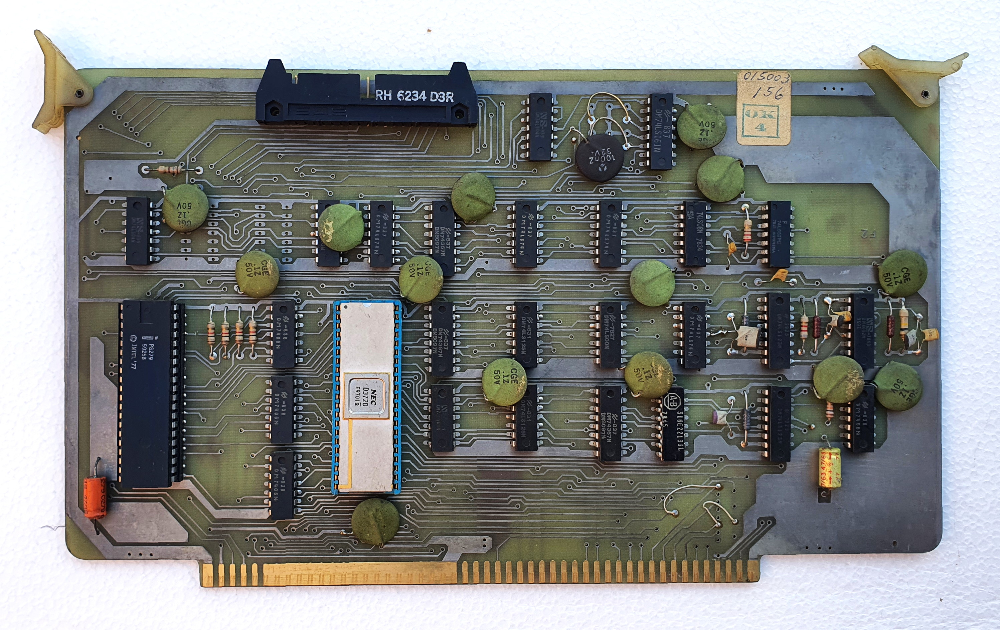
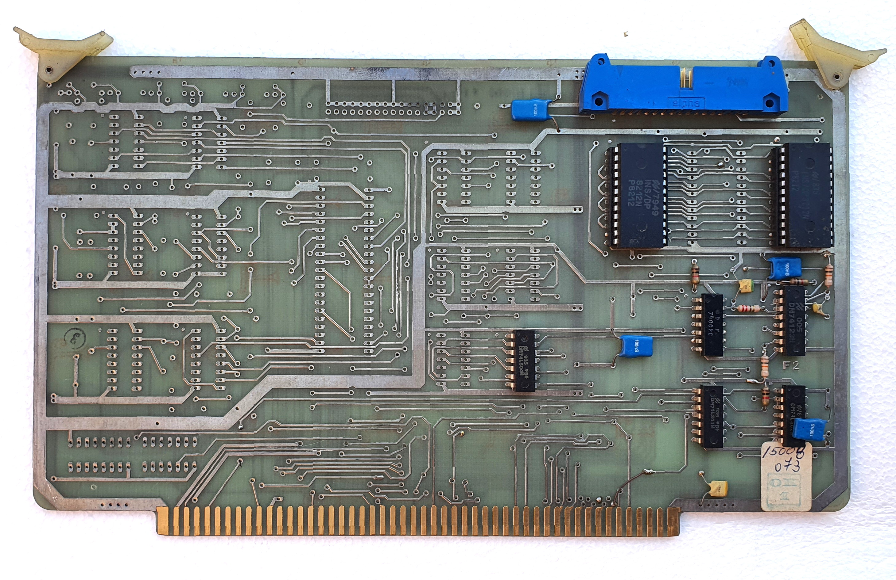
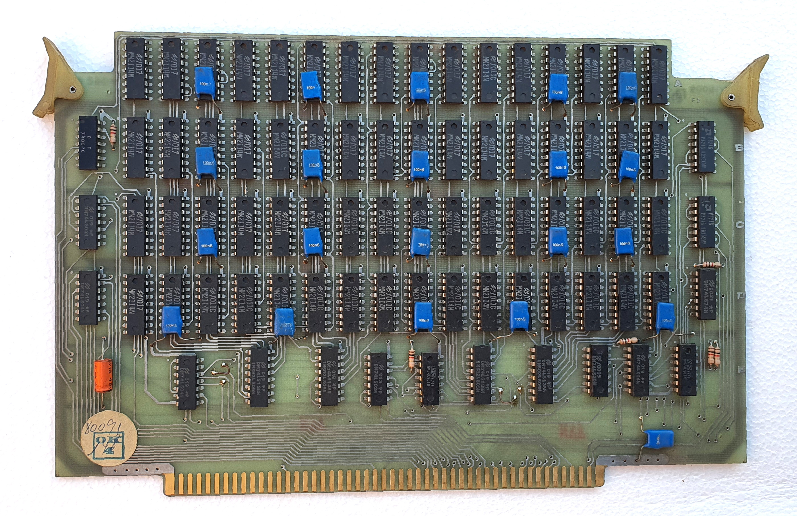
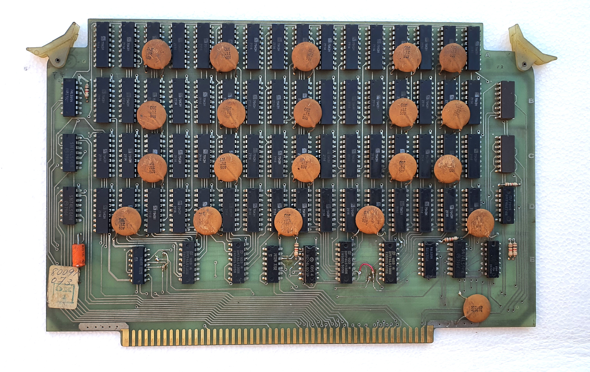

La MS104 fue la sucesora de la MS101.
Lanzada en 1979 se presentaba como un mueble de lata con una cajonera lateral que incluía dos unidades de diskette 8" y un cajón donde estaban las placas con bus físico S100.

La MS104 fue la primera CP/M compatible que fabricó Microsistemas y sus características técnicas era muy similares a la MS101.

* CPU Intel 8080A 2 MHz.
* 2 placas de 32 KiB de RAM.
* Placa generadora de caracteres 64x16 con 1 KiB de RAM conectado a un monitor fósforo blanco de 9".
* 2 disketteras Shugart 8" con controladora µPD372 de NEC.
* Gabinete de chapa fabricado por Metalúrgica Lo Ré.

 
Folleto comercial de la época.

La MS104 era una máquina dual, ya que podía funcionar como una graboverificadora MS101, o como una computadora CP/M compatible.
Al parecer el comando para pasar de MS104 a MS101 era `GO101`.
Cuando tengamos el dump de las ROMs podremos verificarlo.

Placas de la MS-104, ejemplar de Pablo Gaggino
---

  Generador de caracteres 64x16 con <a href="https://bytecollector.com/archive/mark_8/My_Mark-8_Info/DigitalGroupPacket/M6570.pdf">MCM6571A</a>

  CPU 8080A y ROMs 2708.

  Controladora de disco <a href="https://archive.org/details/bitsavers_necdatasheControllerMar77_2929335">µPD372</a>.

  Controlador de Entrada/Salida.

  32 KiB inferiores usando 64 RAMs estáticas 2114 1Kx4.

  32 KiB superiores usando 64 RAMs estáticas 2114 1Kx4.

