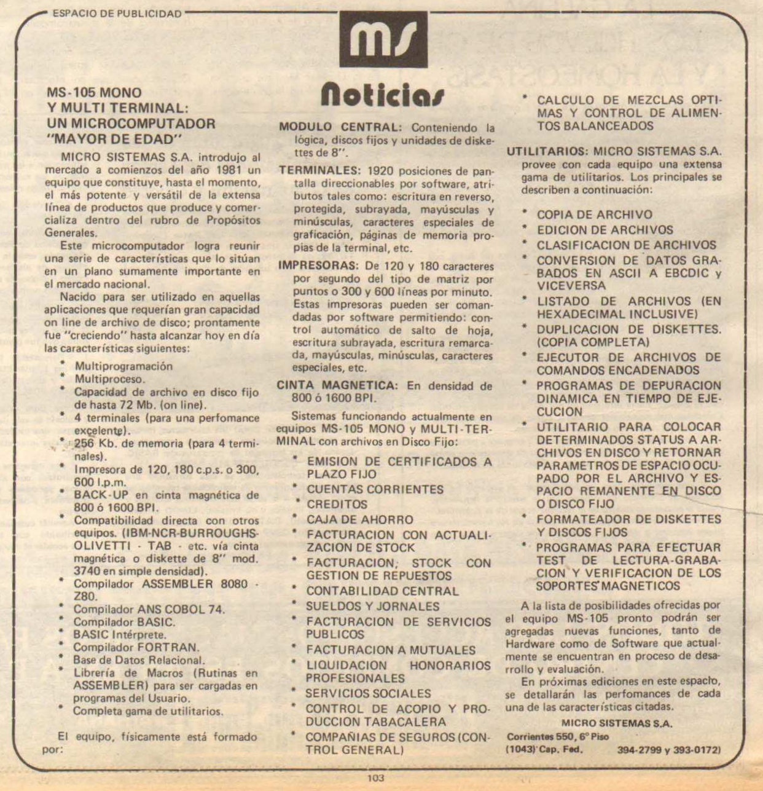

La MS105 fue lanzada a comienzos de 1981.
Era un diseño CP/M tradicional, ya no dentro del linaje MS101-MS102-MS104.
La comunicación era a través de terminales bobas y tenía la posiblidad de instalar discos duros, muchas tarjetas de comunicación serial y se ofrecía como una solución de multiprocesamiento usando MP/M.

Características Técnicas
---

* CPU Zilog Z80 4 MHz?
* ? RAM.

Publicidad en <a href="https://mundoinformatico.com.ar/wp-content/uploads/2019/09/MI_050.pdf">Mundo Informático #50</a>, página 2.
 

