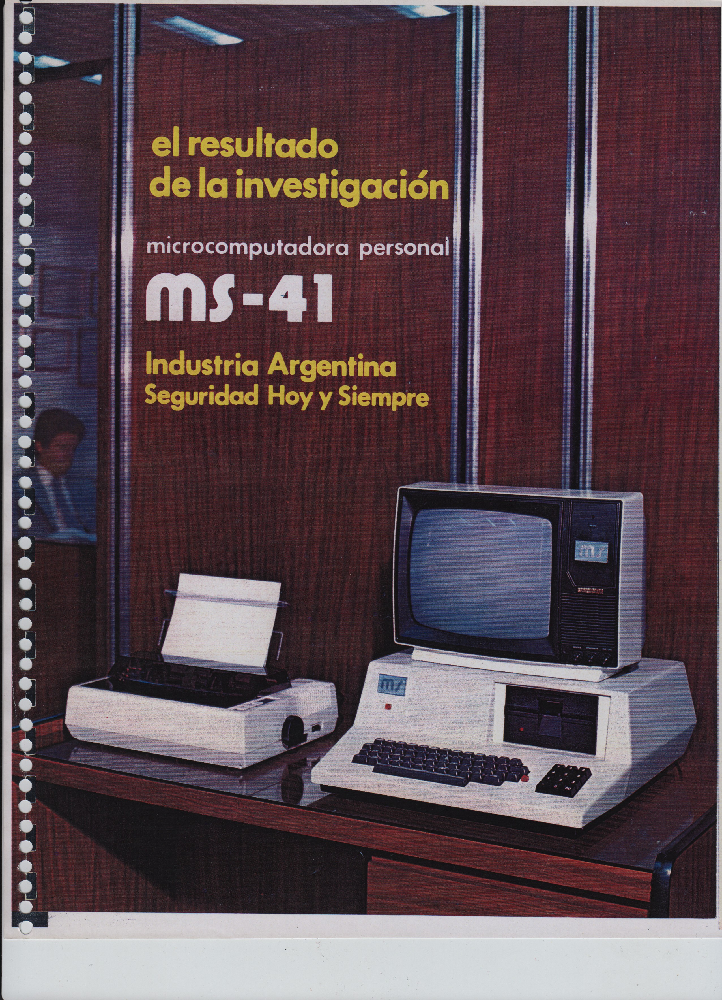

MS41
====

Especificaciones Técnicas
---
Año: 1983  
CPU: Z80@4MHz  
RAM: 64 KiB  
Bus: S-100  
IO: puerto paralelo, conexión para segunda unidad de diskettes  
Monitor: televisor externo o monitor, resolución 80x25 caracteres  
Almacenamiento: 1 floppy Shuggart 5 1/4" full height  
Sistema Operativo: CP/M  
Gabinete: ?  

La computadora está basada en una placa S-100 con todo incluído denominada MS-021, probablemente sea la [SBC021](../MS51/SBC_021.pdf) que utilizaban algunos modelos de [MS51](../MS51/) y la [MS105](../MS105/).

Folleto
---

Prensa
---

Revista Telegráfica Electrónica, Agosto 1983.

Mundo Informático, <a href="https://mundoinformatico.com.ar/wp-content/uploads/2019/09/MI_074.pdf">Volumen IV, No. 74</a>, segunda quincena de agosto, 1983.

Ejemplares
---

Ninguno por el momento.
