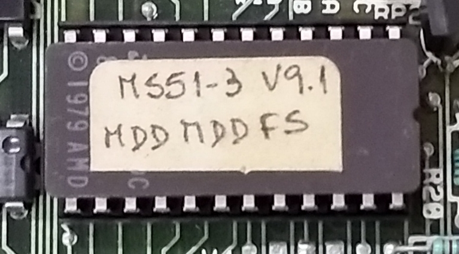

MS51 que probablemente perteneció a la [ESCMB](https://mb.unc.edu.ar/)
====

Es una revisión 2 de la MS51 que llegó al [Programa de Reciclado de Computadoras de la UNC](http://www.liade.inv.efn.uncor.edu/?page_id=89) en 2009.
Es decir tiene disketteras half-height y una sola placa que integra CPU, RAM, ROM, IO, FDC.

ROM
---

[MS51-3_V9.1_MDDMDDFS.rom](MS51-3_V9.1_MDDMDDFS.rom)

