MS51 V2
====

Es una revisión 2 de la MS51 la cual fue adquirida y restaurada por Jonatan Khalil Seletti durante los años 2024 y 2025, este equipo dispone de dos disqueteras media altura y una sola placa que integra CPU, RAM, ROM, IO, FDC. Asimismo, es importante destacar que esta computadora proviene de la provincia de San Juan, República Argentina. 

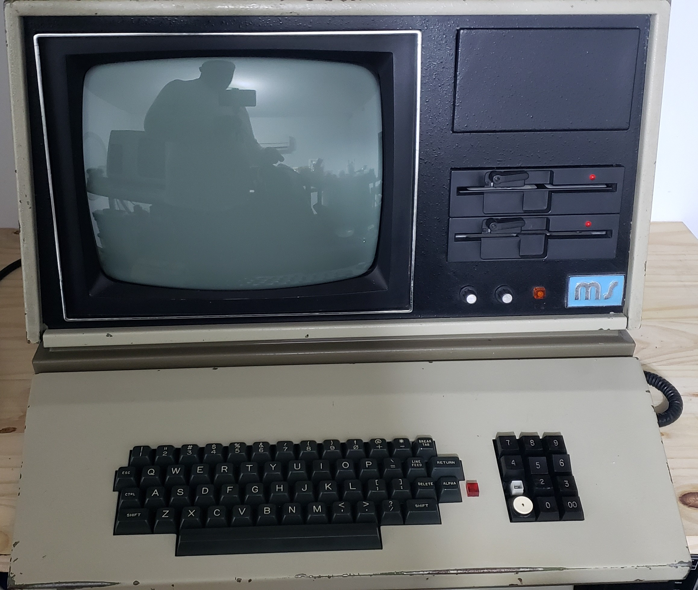

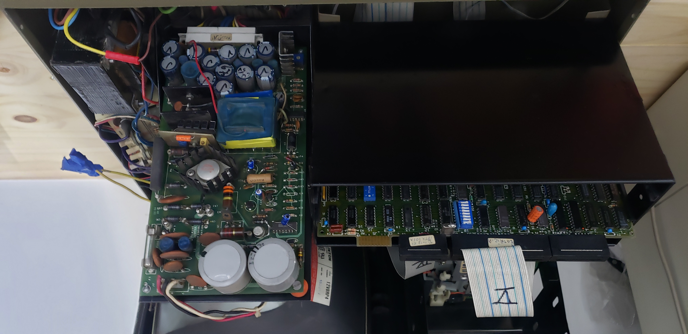

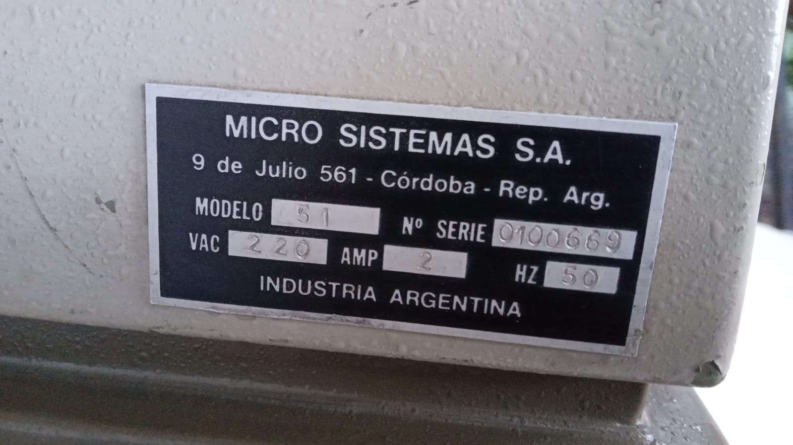

ROM MONITOR
-----------

[MS51-V9.1_Khalil.BIN](MS51-V9.1_Khalil.BIN)

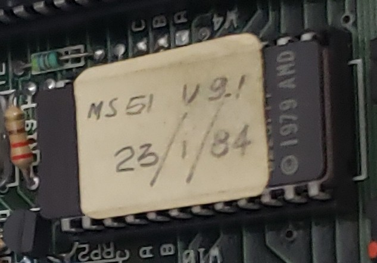

SBC (Single Board Computer)
---------------------------

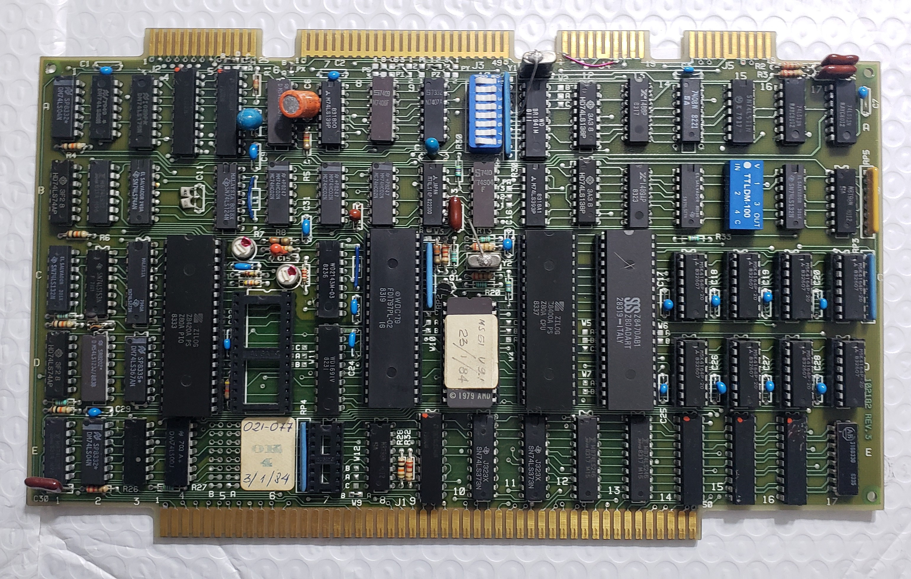

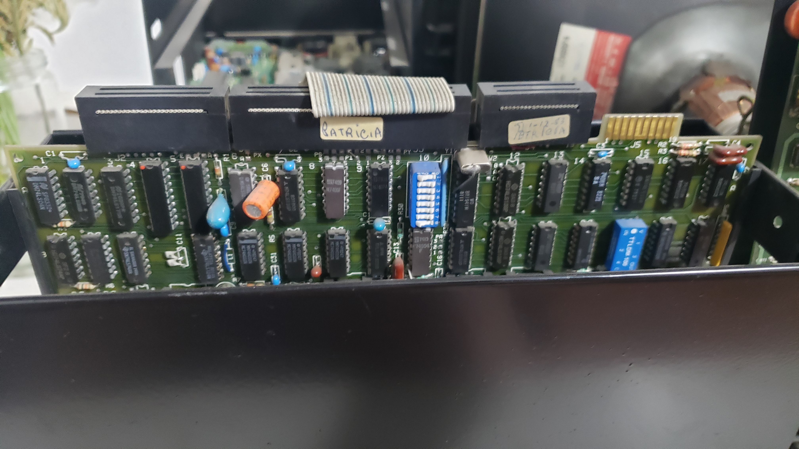

BUS S-100
---------

Observamos los 4 slots del bus S-100, en esta revisión solo se usa uno de estos conectores.

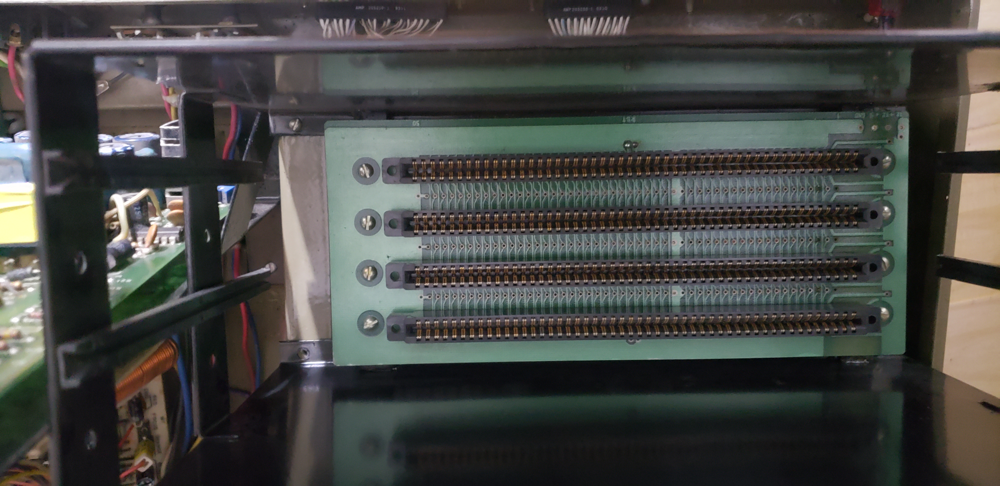

Placa CRT
---------

Esta placa procesa la imagen generada en la placa de terminal para luego proyectarla en el tubo CRT.

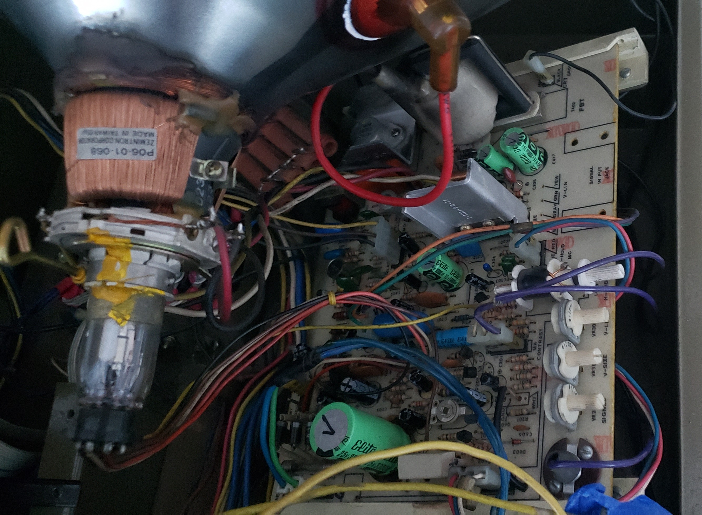

Terminal / Teclado
------------------

La imagen que vemos en pantalla es producida por esta placa en la cual también se encuentra integrado el teclado y la conexión al BUS-100 donde se encuentra la placa SBC.

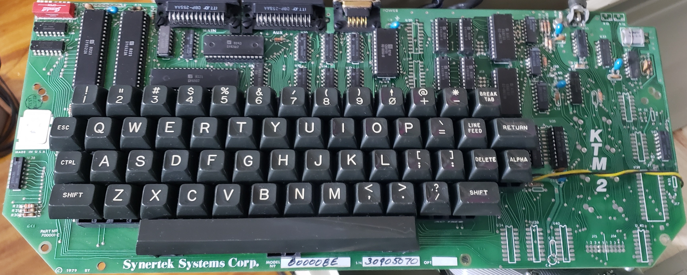

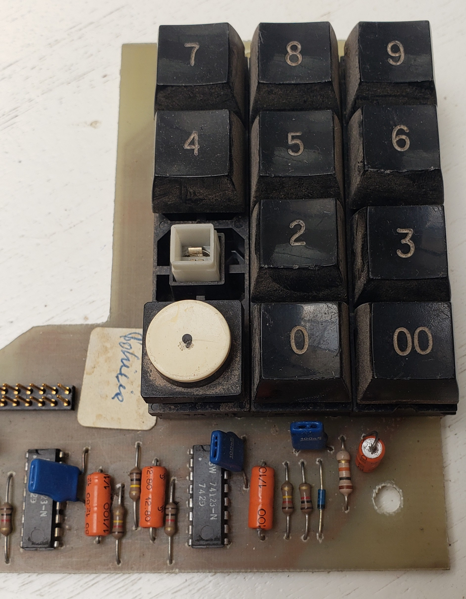

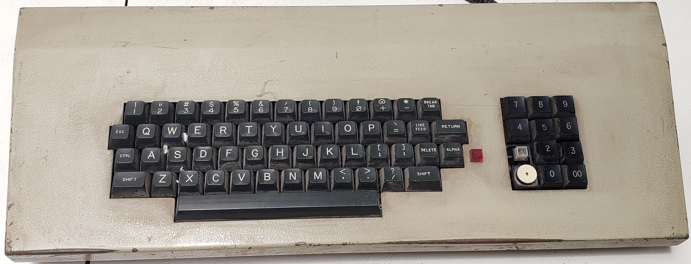

FDD – Disqueteras Shugart SA-455
--------------------------------

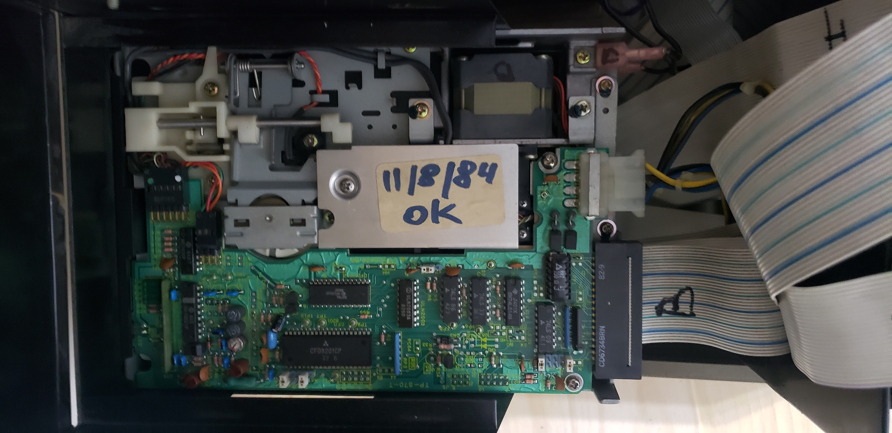

Fuente de poder
---------------

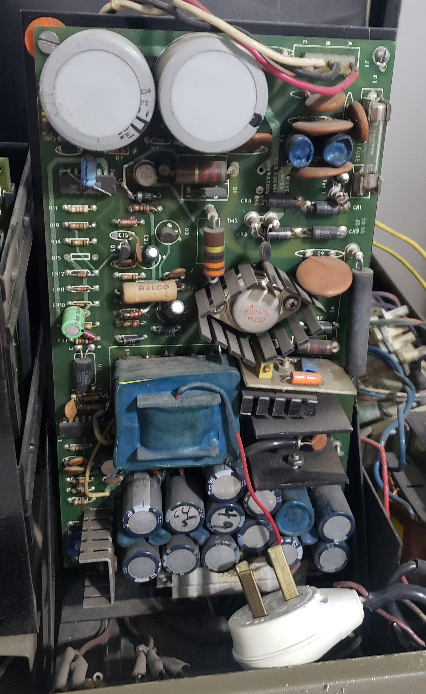

Intento de arranque
-------------------

Intento de arranque con las imágenes de disco provistas por Nicolás Wolovick.

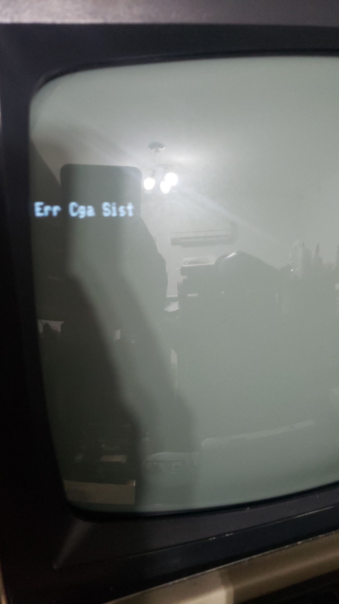
