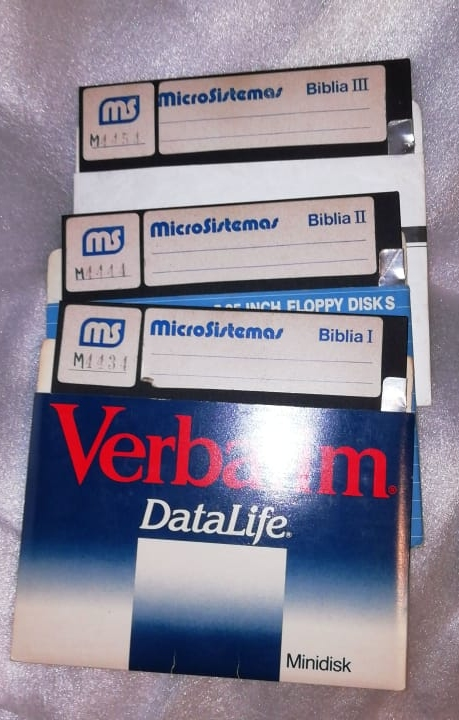

MS51
====

Especificaciones Técnicas
---
Año: 1982
CPU: Z80@4MHz
RAM: 64 KiB
Bus: S-100 mecánico, eléctrico y lógico.
IO: terminal serial 9600 baudios con conexión a video compuesto [Synertek KTM-2/80](http://retro.hansotten.nl/6502-sbc/synertek-sym-ktm/ktm-2-ktm_2-80/)
Monitor: fósforo verde 12"
Almacenamiento: 2 floppies Shuggart 5 1/4"
Sistema Operativo: CP/M
Gabinete: chapa de Metalúrgica Lorré.

Modelos
---

Hubo al menos dos modelos, uno basado en la SBC-200 (single board computer) con 4 placas y 2 disketteras [Shugart SA400](https://commons.wikimedia.org/wiki/File:Shugart_SA_400_Minifloppy_Drive.jpg) 5 1/4" full-height.
La placa [SBC-200](http://www.s100computers.com/Hardware%20Manuals/SD%20Systems/SD%20Systems%20SBC-200.pdf) de SD Systems venía toda armada y Microsistemas la integraba.
Esto representa un retroceso respecto a los desarrollos locales como [MS101](../MS101) y [MS104](../MS104), que luego se revierte en la [MS61](../MS61).

El otro es más moderno y se diferencia en que tiene dos disketteras half-heigth [Shugart SA455](http://www.bitsavers.org/pdf/shugart/SA4xx/SA455_SA465_Service.pdf) e internamente utiliza una sola placa que contiene CPU, ROM, RAM, IO y floppy controller.
Muy probablemente esta placa haya sido comprada en EEUU.

Ejemplares
---

* [ESCMB](EjemplarESCMB/): versión 2, apareción en el Programa de Reciclados de Computadoras de la UNC.
* [Alejandro Mogni](): versión 1, donada por el mismo Alejandro Mogni.
* [Carlos Rizzi](): versión 2, donada por el Ing. Carlos Rizzi de San Francisco.

Misceláneas
---

[Video](https://www.youtube.com/watch?v=65s0TAGvQp4) del ejemplar del Analista de Sistemas Carlos Aguilera.
Se puede ver que es una MS51 versión 1.

Mini-diskette de 5.25" con software de alineación de cabezales, perteneciente a Carlos Pellegrini

"La Biblia", conjunto de diskettes que genera los diskettes de sistema.
Material donado por Leo Martínez, que pertenecía a su padre Pepe Martínez, el representante de Microsistemas en Goya, Corrientes.

