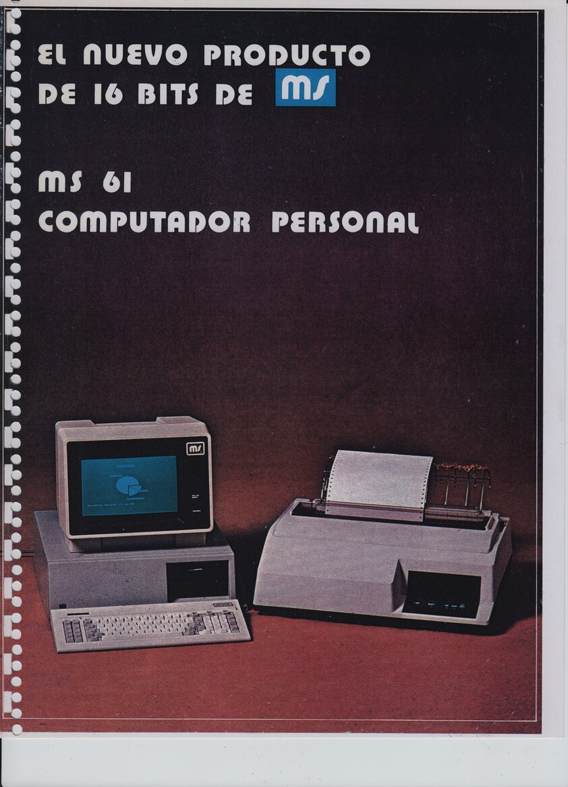
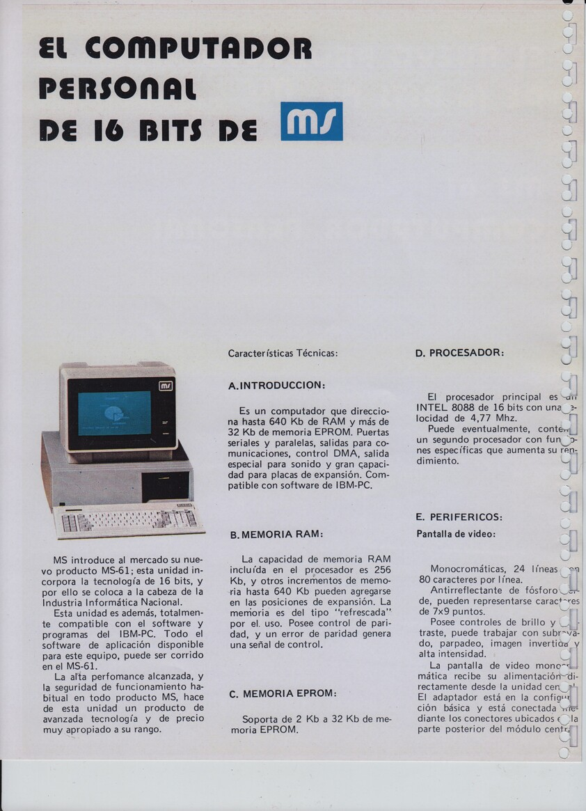
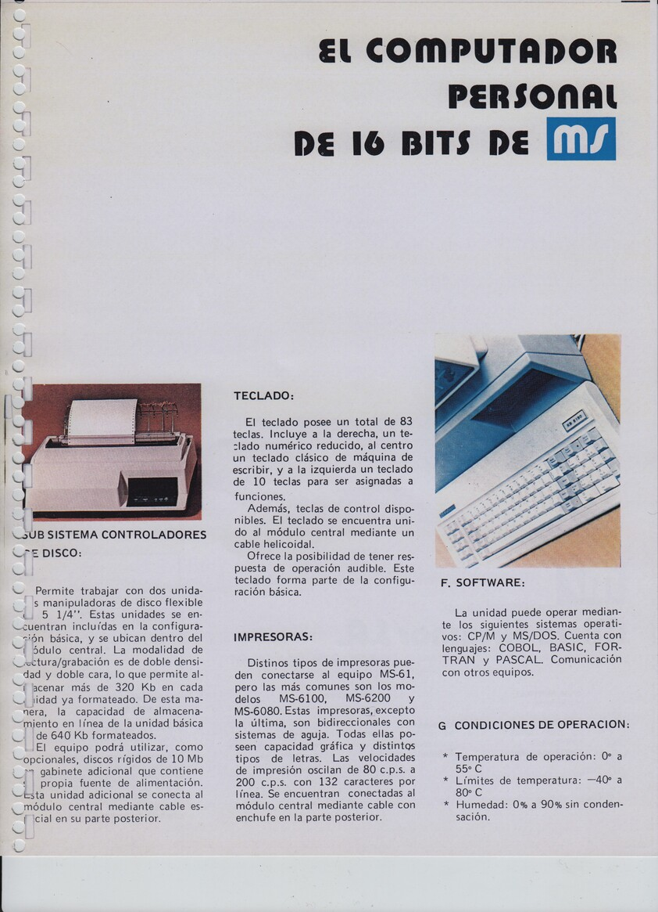
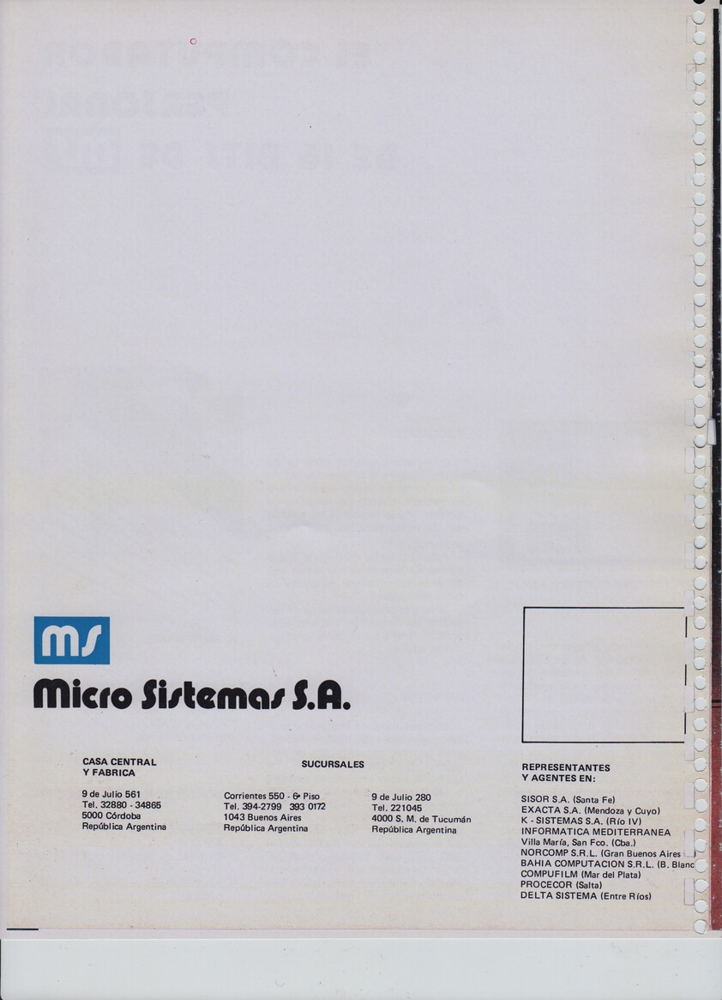

La MS61 fue lanzada en 1984, y fue la primera IBM PC compatible de MicroSistemas.

Al parecer hubo dos versiones.
La primera con placa diseñada y montada en MicroSistemas y la segunda con una placa marca Faraday.
Se desprende de la entrevista a [Juan Salonia](../../Personas/Juan%20Salonia) realizada en 2010, que la versión 1 fue una tirada de 50 placas.

Características Técnicas versión 1
---

* Dos sub-versiones 84001-B y 84001-C
* CPU 8088-2
* ? RAM.
* Placa genérica ISA 8 bits CGA.

El técnico de MicroSistemas Carlos Pellegrini nos facilitó los [circuitos esquemáticos](esquemáticos_ms61_carlos_pellegrini.pdf).
Notar que faltan algunas páginas y que para el plano principal que contiene el oscilador, el procesador y el coprocesador hay dos versiones 84001-B y 84001-C.

Características Técnicas versión 2
---

* CPU 8088
* ? RAM.

Ejemplar Noblitá
---
Este ejemplar es de Gabriel Noblitá en Mendoza y hasta ahora es la única placa MS61 diseño MicroSistemas que hemos encontrado.

Ejemplar Vodanovic
---
Este ejemplar está en [FaMAF](https://www.famaf.unc.edu.ar) y fue conseguido por Gonzalo Vodanovic.
Esta máquina perteneció a una fábrica de calzado.

