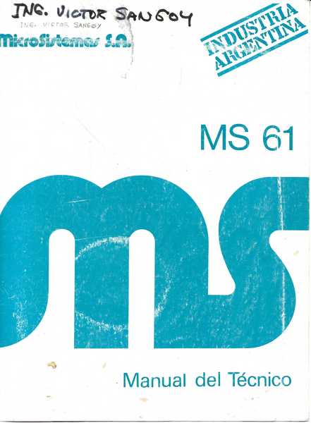
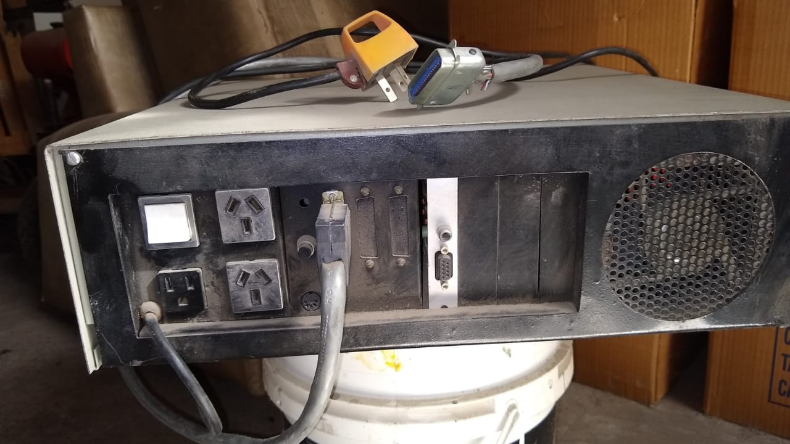

La MS61 fue lanzada en 1984, y fue la primera IBM PC compatible de MicroSistemas.

Se fabricaron dos versiones.
La primera con placa diseñada y montada en MicroSistemas y la segunda con una placa marca Faraday.
Se desprende de la entrevista a [Juan Salonia](../../Personas/Juan%20Salonia) realizada en 2010, que la versión 1 fue una tirada de 50 placas.

Características Técnicas versión 1
---

* Dos sub-versiones 84001-B y 84001-C
* CPU 8088-2
* 64 KiB RAM, ampliable en placa hasta 320 KiB con 41
* Placa genérica ISA 8 bits CGA.

El Ing. de MicroSistemas Carlos Pellegrini nos facilitó losi
Con el aporte del Ing. Víctor Sangoy, tenemos ya todas las páginas del esquemático, incluyendo diskettera y video.

[Esquemáticos MS61](esquemáticos_ms61.pdf)

El Ing. Víctor Sangoy escaneó "MS61, Manual del Técnico"

* [Portada](MS61_portada.pdf)
* Capítulo 0: [Índice e Introducción](MS61_chp0.pdf)
* Capítulo 1: [Placa Base](MS61_chp1.pdf)
* Capítulo 2: [Placa de video](MS61_chp2.pdf)
* Capítulo 3: [Bios en ROM](MS61_chp3.pdf)

Características Técnicas versión 2
---

* Placa madre importada marca Faraday.
* CPU 8088.
* ? RAM.

Ejemplar Noblitá
---
Este ejemplar es de Gabriel Noblitá en Mendoza y hasta ahora es la única placa MS61 diseño MicroSistemas que hemos encontrado.

Gabriel gentilmente dumpeó la ROM 27128 (16 KiB) con etiqueta "AXIS 2.0" [AXIS20.bin](AXIS20.bin).

Ejemplar Vodanovic
---
Este ejemplar está en [FaMAF](https://www.famaf.unc.edu.ar) y fue conseguido por Gonzalo Vodanovic.
Esta máquina perteneció a una fábrica de suelas de calzados "Goma Pons", de Antonio Pons e hijos en la calle 12 de Octubre esquina Jujuy de Barrio Cofico en la Ciudad de Córdoba.
Según los testimonios esta computadora costaba alrededor de 8000 dólares estadounidenses cuando se compró.

El volcado de la BIOS en EPROM 2764 (8 KiB) con etiqueta "MS61 V1.4 10/10/84": <a href="ms61_v14_19841010.bin">ms61_v14_19841010.bin</a>

