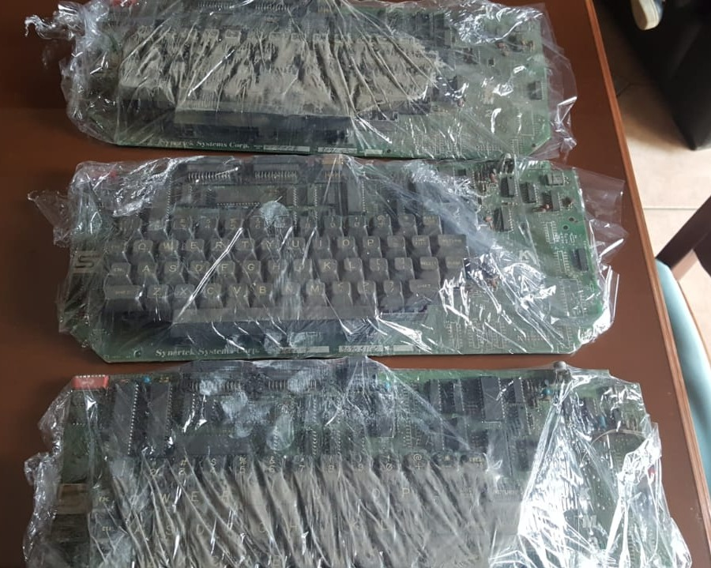
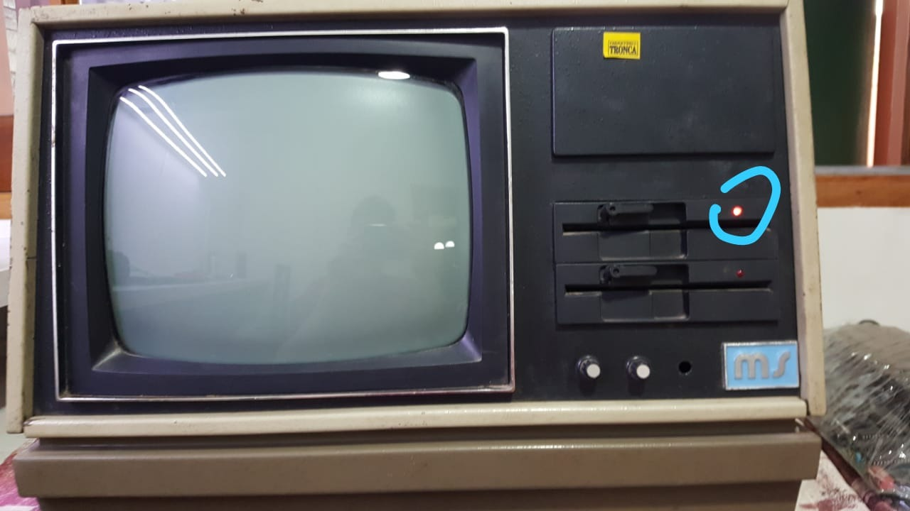

Carlos Alberto Díaz-Rizzi
---

Carlos Alberto Díaz (también Rizzi), trabajó en Micro Sistemas en Av. Japón desde 1987 a 1992.

Empezó armando cables con [Mary Andrada](../Mary%20Andrada/).
Luego [Hugo Bonansea](../Hugo%20Bonansea) lo llevó al Departamento Compras.
Lo despidieron de Micro Sistemas en la segunda reducción de personal en 1992.

Gentilmente Carlos donó en septiembre 2019 estos ejemplares que están en FaMAF-UNC y que fueron expuestos en La Noche de los Museos 2019 en el OAC.

  
3 terminales KTM-2, 1 MS-51 SBC-021 con sticker de Ferretería Tronca.

  
3 terminales [KTM-2](http://retro.hansotten.nl/6502-sbc/synertek-sym-ktm/ktm-2-ktm_2-80/)

  
MS51 encendida, buscando boot de CP/M, pero sin video porque era generado por la terminal KTM-2.

