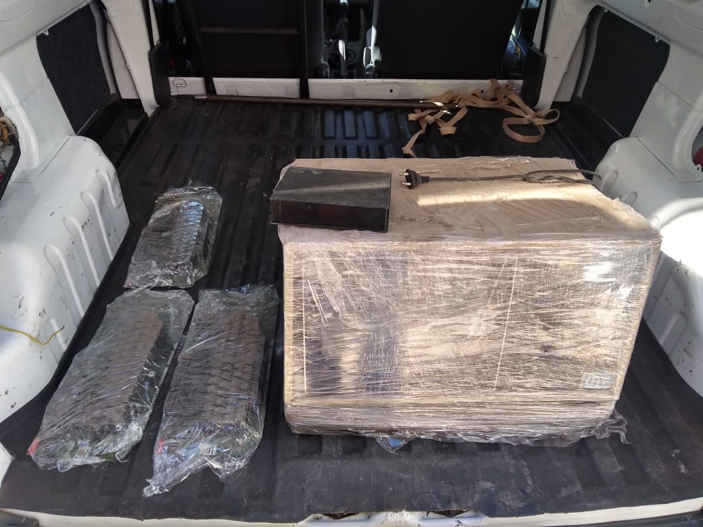

Carlos Alberto Díaz-Rizzi
---

Carlos Alberto Díaz (también Rizzi), trabajó en Micro Sistemas en Av. Japón desde 1987 a 1992.

Empezó armando cables con [Mary Andrada](../Mary%20Andrada/).
Luego [Hugo Bonansea](../Hugo%20Bonansea) lo llevó al Departamento Compras.
Lo despidieron de Micro Sistemas en la segunda reducción de personal en 1992.

Gentilmente Carlos donó estos ejemplares que están en FaMAF-UNC.

