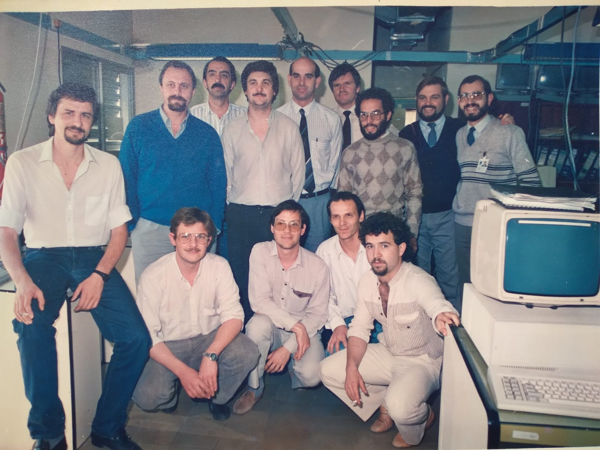

Eugenio Calderón
---

Eugenio trabajó en Micro Sistemas en Av. Japón en un breve periodo de 1988: del 8 de agosto al 16 de noviembre.
Su cargo fue Analista Programador Sr. y y hacía Desarrollo de Software de Base en el Proyecto Bancario 386.
Los equipos que usaban eran: Microsistemas MS-71 con DOS-3.20 y MS-Axis 386 SCO-Xenix.

Equipo de MicroSistemas en la segunda mitad de 1988.
Eugenio Calderón es el séptimo de la fila superior de izquierda a derecha.

