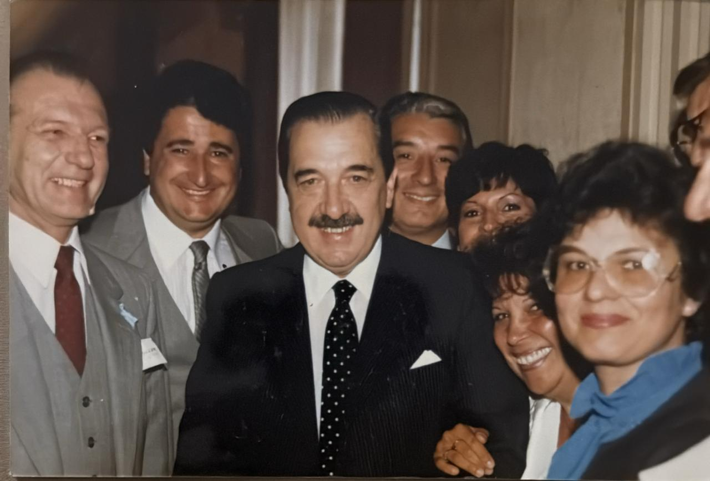

Héctor "El Gringo" Müller
===

El Gringo nace el 14 julio 1941, en Córdoba Capital, en Bo. San Martín frente a la Carcel, calle Soldado Ruiz.

 
Héctor Müller con el Presidente Raúl Alfonsín en el Círculo Argentino de San José, Calofornia, EEUU.
 
Muy probablemente en una visita que Alfonsín hizo del sábado 20 al lunes 22 de junio de 1987.
 
"[Argentine Leader Welcomed to S.D. : Alfonsin to Receive Awards During Three-Day State Visit](https://www.latimes.com/archives/la-xpm-1987-06-20-me-8452-story.html)", por Patrick McDonnell, 20 junio 1987, LATimes

Héctor "El Gringo" Müller era el softwarista de MicroSistemas junto a Freddy Díaz.
Fue la cabeza detrás del software/firmware de la MS101 y MS104.
Luchó contra la µPD372 hasta que la hizo funcionar.

El Gringo se estableció en San José (CA) en 1979.
Fue parte del [Círculo Argentino de San José](https://web.archive.org/web/20071007151405/http://www.circuloargentino.com/carta%20del%20lector.htm).
Vivió junto a su segunda esposa Stella Maris Barizone en *2387 Lida Dr*, Moutain View, California, EEUU.

Dice Julio Eduardo Bazán en su libro "DOS" del año 2008 aún no editado:
> Recuerdo una anécdota ilustrativa que me sucedió junto a Müller, cuando el ya estaba instalado en la calle **Lida Drive** de Mountain View.
> Habíamos concurrido a una firma de la zona que representaba a empresas japonesas a solicitar cotizaciones de algunos productos ...

El Gringo es una figura central de este libro y tiene dedicados párrafos como este:
> Tuve la suerte de conocer a tres personajes importantes de la revolución microelectrónica. Steve Jobs a mi juicio fue el más significativo de todos y mi conocimiento de el es un recuerdo fugaz del jovencito con mameluco jardinero.
> Gary Kildall junto con el gringo Müller fueron dos genios del software y Bill Gates un gran comerciante, pero no es el visionario que todos le atribuyeron.

El Gringo trabaja en MicroSistemas hasta 1983 cuando la empresa es comprada por el Grupo SADE del "Goyo" Perez Companc, donde a Héctor le compran sus acciones y lo desafectan.

Su hijo Ariel Müller cuenta:
> Luego de su salida de Micro Sistemas SA fundó Maxxima Corporation y eran solamente él y Stella.
> ¿Donde tenía la oficina?
> En la esquina de Charleston Road y Alta Avenue años más tarde ahí estaría Google…

Maxxima Corporation hizo diversos productos como por ejemplo un hardware para spooler de impresonra.

Héctor Müller falleció el 26 de abril de 2003. El día en que se ejecutaba el virus Chernobyl.
En una humorada algunos amigos que fueron al sepelio decía que el virus se vengó de él ya que años antes había fabricado una placa antivirus.
Stella Maris Barizone fué su segunda mujer y quien lo acompañó en su estancia en USA desde 1979 hasta 1990 año en qué regresó definitivamente a la Argentina.
Stella falleció en Dic 2022.
