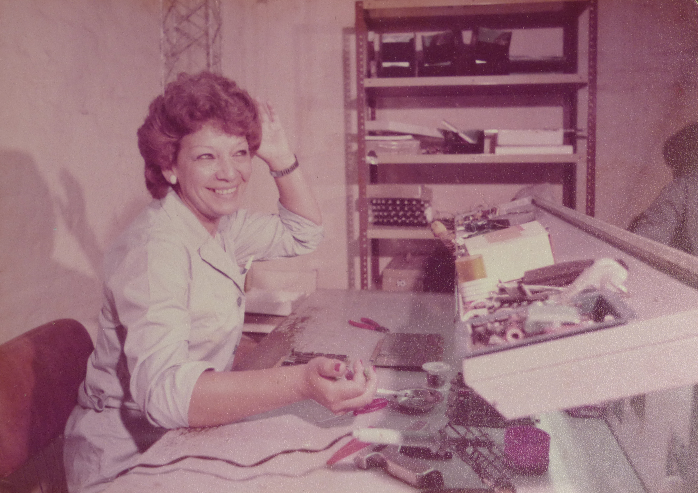

Mary Andrada
===

Luego de trabajar en Transradio y Fapeco armando equipos transmisores de radio, Mary Andrada vuelve a su Córdoba a trabajar en Micro Sistemas.

En su banco de trabajo de Av. Fuerza Aérea 1760.

Armando placas de video para la MS101, MS102 y MS104 en ese mismo lugar.
