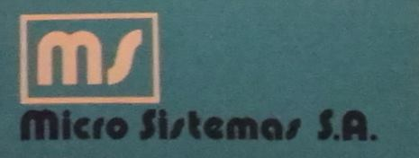

```
MICRO-SISTEMAS    M.S. 101                FECHA:

-D- ENTRADA O MODIF.DE FORMATOS
-G- GRABACION DE ARCHIVOS       
-B- BUSQUEDA EN ARCHIVOS        
-V- VERIFICACION DE ARCHIVOS    
-R- RECUPERACION DE ARCHIVOS    
-Z- EMISION DE DIRECTORIO       
-F- FORMATEO DE DISCOS          
-S- COPIA DEL SOFTWARE M.S.101  
-C- CLASIFICACION DE ARCHIVOS   
-M- OPERACION DE CINTA MAGNETICA

FUNCION:
```


Máquinas
===

[MS101](Máquinas/MS101/index.md), 1977

[MS104](Máquinas/MS104/index.md), 1979

[MS105](Máquinas/MS105/index.md), 1981

[MS51](Máquinas/MS51/index.md), 1982

[MS41](Máquinas/MS41/index.md), 1983, agosto

[MS61](Máquinas/MS61/index.md), 1984


Personas
===

Julio Eduardo Bazán, socio fundador, 1975-?, ?-?

Héctor Müller ("El Gringo"), softwarista, 1975-?

Juan Carlos Murgui, hardwarista, 1975-?

Freddy Díaz, softwarista, 1975-?

[Juan Salonia](Personas/Juan%20Salonia/), hardwarista, 1975-?

Alicia Morillo, telefonista, secretaria bilingue

Tomás Behrend, softwarista

Hugo Bonansea, hardwarista

[Mary Andrada](Personas/Mary%20Andrada/), ensamble, 5/5/1977 - 1994

Eduardo Salonia, técnico

[Alejandro Mogni](Personas/Alejandro%20Mogni/)

Héctor Ramón Luján

Jorge Apestegui, 1979-1983

Gustavo de Fillipi, inversor

[Carlos María Molina](Personas/Carlos%20Molina/)

Carlos Pellegrini, 11 ago 1981-?

[Gabriel de Luca](Personas/Gabriel%20de%20Luca/), ensamble y calidad, 1 jun 1984 - >ago 1991

Guillermo Fessia

José García, técnico Capital Federal, 27 jul 1981-?

Patricio Rodriguez, vendedor, 1977-1987

Victor Sangoy, calidad, 1984-1989

Mario Víctor Venzon, técnico

[Carlos Alberto Díaz-Rizzi](Personas/Carlos%20Díaz-Rizzi), técnico, 1987-1992

Enrique Ike Mora, mantenimiento, Av. Japón

Patricia Bustos, secretaria y recepcionista, Av. Japón

[Eugenio Calderón](Personas/Eugenio%20Calderón), desarrollo software de base, agosto a noviembre 1988


Lugares
===

Santa Rosa 859, 1975?-1977. [📍](https://www.google.com/maps/place/Sta+Rosa+859,+X5000ESQ+C%C3%B3rdoba)

9 de Julio 561, 1978-?. [📍](https://www.google.com/maps/place/9+de+Julio+561,+X5000EMK+C%C3%B3rdoba). Casa demolida entre [2015 y 2018](https://www.google.com/maps/place/9+de+Julio+561,+X5000EMK+C%C3%B3rdoba/@-31.4127128,-64.190945,3a,75y,230.23h,91.21t/data=!3m6!1e1!3m4!1s8Y_7Qu8Ob5SFPlQN48Z51g!2e0!7i13312!8i6656!4m5!3m4!1s0x9432987f6cc0271f:0xe741418b08cfa5a0!8m2!3d-31.412828!4d-64.191009).

Av. Fuerza Aérea 1760, 1980?-?. [📍](https://www.google.com/maps/place/Av.+Fuerza+Aerea+Argentina+1760,+C%C3%B3rdoba/)

[Av. Japón 210](Lugares/AvJapon), 1985-1992?. [📍](https://www.google.com/maps/place/Av.+del+Jap%C3%B3n+210,+X5019BGP+C%C3%B3rdoba/)

[Plan de Ordenamiento Urbano](Lugares/PlanOrdenamientoUrbano_Sinsacate_nov88.pdf), Municipalidad de Sinsacate, noviembre 1988.  
Esto era el Polo Informático de Sinsacate relacionado a la Resolución 44/1985 de la Secretaría de Industria.


Empresas
===

PROCECOR

Metalúrgica Lo Ré

CEPICO

[LACI](Empresas/LACI) (Laboratorio Argentino de Circuitos Impresos)

SADE


Publicaciones
===

* José G. Morales Pensso, Roberto M. Rivas Jordán, [El rol del "desraizamiento" en la educación tecnológica: nuestra experiencia con una MS51 de Micro Sistemas](https://publicaciones.sadio.org.ar/index.php/JAIIO/article/view/377), [SAHTI 2022](https://51jaiio.sadio.org.ar/simposios/SAHTI), 51JAIIO.
* José G. Morales Pensso, Roberto M. Rivas Jordán, [¿Qué papel tenían los agentes humanos en los inicios de la microcomputación? La MS51 desde adentro](Publicaciones/la_MS51_desde_adentro.pdf), marzo 2022.
* Ezequiel Chesini, Gustavo del Dago, Nicolás Wolovick, [Micro Sistemas, el salto olvidado](https://revistareplay.com.ar/comprar/), Revista Replay, número 21, diciembre 2020.
* Ezequiel Chesini, Gustavo del Dago, Nicolás Wolovick, [MS101, La Maquinita de Bazán](Publicaciones/MS101LaMaquinitaDeBazán.pdf), SHIALC 2018.
* Guillermo Rojo, [Micro Sistemas, empresa cordobesa pionera en la fabricación de computadoras en la Argentina](Publicaciones/clei2014_submission_59.pdf), SHIALC 2014.
* Nicolás J. Herencic, [Microsistemas S.A.: El Salto Tecnológico](Publicaciones/MICROSISTEMAS_El_Salto_Tecnologico.pdf), Ediciones Banco de la Provincia de Buenos Aires, Testimonios No.10, julio 1987.

